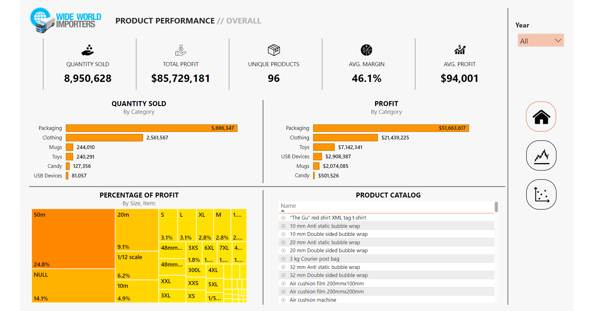
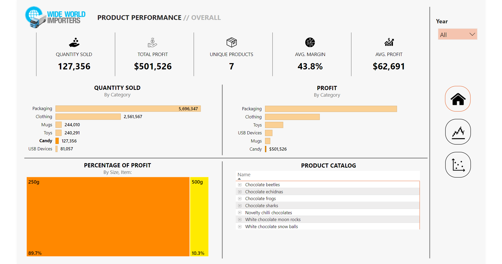
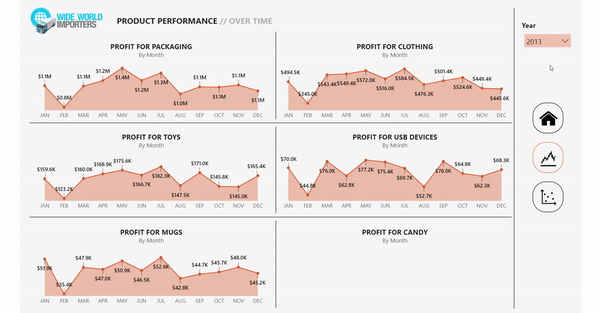
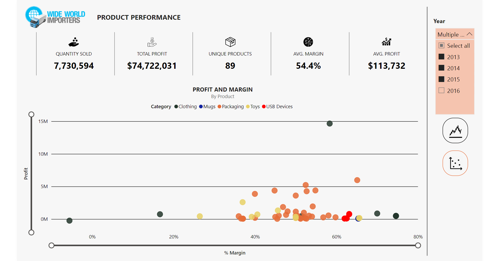
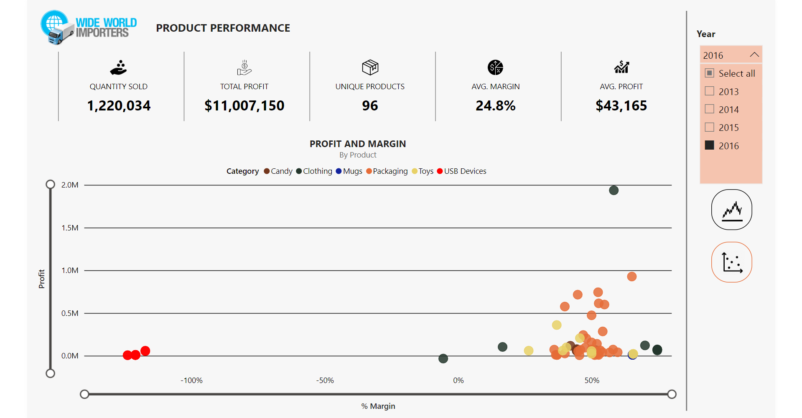
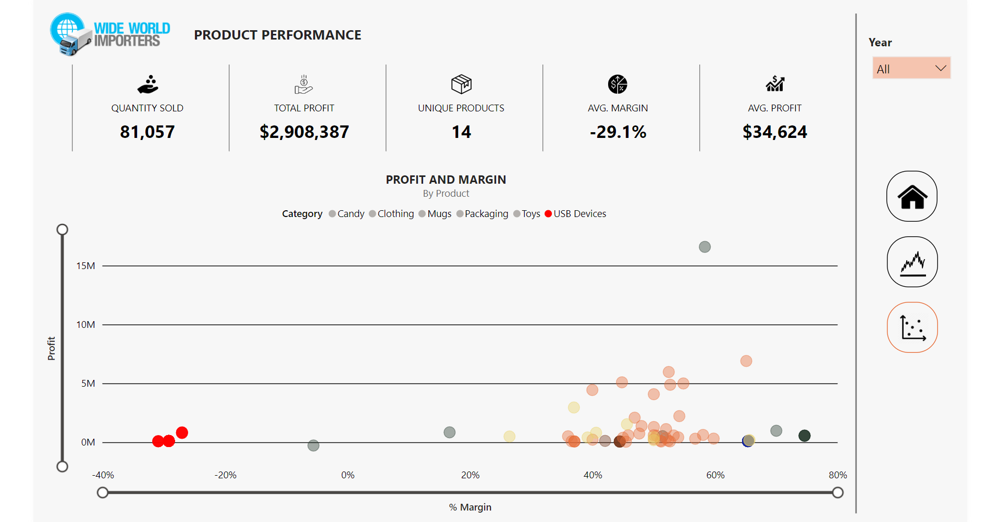

# Wide World Importers - Product Analysis
## Wide World Importers

Wide World Importers is a wholesale novelty goods importer and distributor operating from the San Francisco bay area.

Here is the official website to the SQL [database](https://learn.microsoft.com/en-us/sql/samples/wide-world-importers-what-is?view=sql-server-ver16).

To better understand the dataset, check [here](https://dataedo.com/samples/html/WideWorldImporters/doc/WideWorldImporters_5/views/Website_Customers_3842.html).

You can view the completed interactive dashboard [here](https://admin.onhandbi.com/#/user/report/TmpnMA==?tenant=ohbi_tenant).

## Approach

1. First, SQL was used to create the 'Product' table which detailed qualitative and quantitative data at the granularity level of Stock Item ID. We'd like to see a breakdown of sales success per category > subcategory > product > size/color.

2. Next, SQL was then used to create 'Time' table which will compare transformations of revenue and profit over time.
 
3. Regex was implemented to standardize StockItemName in 'Product' table, and to categorize it in both tables.
 
4. Finally, the two dataframes were exported from SSMS and imported to Power BI.
 
5. The completed dashboard features three pages via sidebar navigation buttons, modular visualizations via filter parameters, and hover tooltips on most graphics and text boxes.

## Data Insights

### New products - New priorities

In 2016, we added 7 new products in a brand new Candy category.

We may need to reconsider how we chose to allocate our resources. It's likely that our ad spend, human resources, and social media efforts were redistributed to promote this new array of products. As proven by our steep decline, our current arrangement is unsustainable.

- Is the new Candy category spreading our resources too thin?

### Q3 is crucial

One key point to note about our metrics is that they've been calculated based only on the first two quarters of 2016, but all four quarters of previous years.

This only partially excuses our sales sums. We are still seeing downward trends in all product categories - the steepest we've seen thus far.

Identifying problem areas such as our dismal unit margin or a lack of resources in other key departments is pivotal for 3rd and 4th quarter improvement. *(see Line Chart)*

### Our contribution margins aren't contributing enough

The standard markup for individual retail products is 50%. In previous years, we've exceeded that number at an average margin of 54%. In 2016, we averaged a troublesome 25%.

One identifiable weak point is our USB category.

This raises a few questions:

- What was the logic behind the price point of USB products?
- Were they part of a promotion?
- Was this part of a loss leader strategy?
